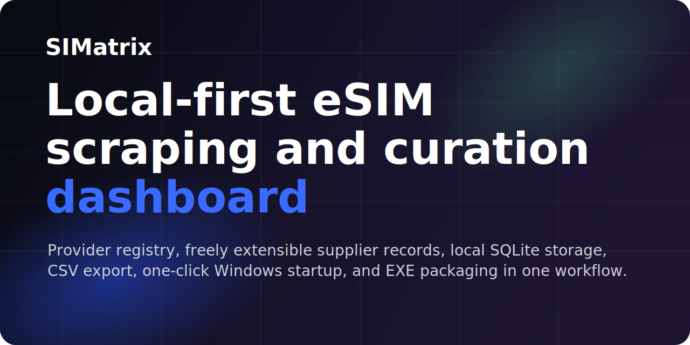
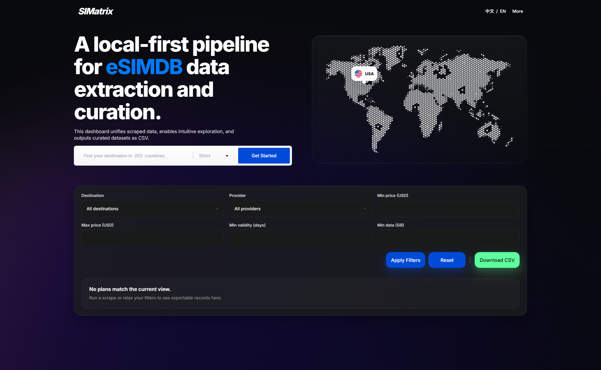

<p align="center">
  
</p>

<h1 align="center">SIMatrix</h1>

<p align="center">
  Local-first eSIMDB scraping, provider curation, local storage, and CSV export in one polished dashboard.
</p>

<p align="center">
  <a href="https://github.com/vs1016/SIMatrix/blob/main/LICENSE"></a>
  
  
  
  
</p>

SIMatrix pulls public plan data from `esimdb.com`, stores everything in a local SQLite database, lets you explore the results in a polished dashboard, and exports filtered datasets as CSV.

## Repository Info

- Suggested description: `Local-first eSIMDB scraper and dashboard for provider curation, filtering, and CSV export.`
- Suggested topics: `fastapi`, `sqlite`, `scraper`, `esim`, `csv`, `dashboard`, `jinja2`, `python`
- License: `MIT`

## What It Does

- Scrapes destination and provider data from eSIMDB
- Caches provider logos and destination metadata locally
- Stores plans in SQLite for fast local filtering
- Provides a dashboard UI in English and Chinese
- Supports provider whitelist management from the `More` page
- Lets you freely add and maintain custom supplier/provider records in the active registry
- Exports the current filtered view to CSV
- Ships with one-click Windows startup scripts and an EXE packaging flow

## Product Preview

<p align="center">
  
  
</p>

## Highlights

- Local-first workflow with no required hosted backend
- Bilingual dashboard with English and Chinese copy
- Destination mega-dropdown, flexible provider registry, and CSV export
- Concurrent provider scraping with local caching for faster reruns
- One-click Windows scripts and an EXE packaging pipeline

## Stack

- FastAPI
- Jinja2 templates
- SQLite
- `httpx` + BeautifulSoup
- `pytest`

## Project Structure

```text
app/          FastAPI app, templates, scraper, provider registry logic
data/         Local runtime data, caches, SQLite database, provider icons
icon/         Destination flag assets
tests/        App and scraper test suite
launcher.py   Starts the local server and opens the browser
```

## Quick Start

### Option 1: One-click local startup

Double-click:

```text
123-clean-start-open-rtg.bat
```

This will:

1. Check and install the local runtime environment
2. Clear the local database
3. Start the service
4. Open the dashboard automatically

### Option 2: Manual startup

```powershell
python -m venv .venv
.\.venv\Scripts\Activate.ps1
pip install -r requirements.txt
python launcher.py
```

Then open [http://127.0.0.1:8000](http://127.0.0.1:8000).

## Workflow

1. Launch SIMatrix with the one-click scripts or packaged EXE.
2. Scrape one or more eSIMDB destinations into the local SQLite store.
3. Filter plans by destination, provider, price, validity, and data.
4. Curate the provider whitelist from the `More` page.
5. Export the current view as CSV.

## One-Click EXE Build

To build the packaged Windows distribution:

```powershell
powershell -ExecutionPolicy Bypass -File .\build-oneclick-exe.ps1
```

The exported EXE bundle is written to:

```text
E:\Program\1-ProgramExports\RTG-OneClick
```

The packaged EXE includes:

- bundled Python runtime
- offline dependency wheelhouse
- first-run environment bootstrap
- the same `0 -> 1 -> 2` startup flow used by the batch scripts

## Dashboard Pages

### Home

- destination search with grouped mega-dropdown
- scrape trigger and progress feedback
- plan filtering by destination, provider, price, validity, and data
- CSV export

### More

- add a provider using either an official provider website or an eSIMDB provider page
- parse and persist provider slug, display name, and logo automatically
- freely extend the active supplier/provider registry with your own entries as needed
- view current active providers
- delete providers from the active whitelist

## Configuration

Environment variables:

- `ESIMDB_BASE_URL`: defaults to `https://esimdb.com`
- `ESIMDB_DATABASE_PATH`: optional SQLite path override
- `ESIMDB_SUPPORTED_DESTINATIONS`: comma-separated destination slugs, default `usa`
- `ESIMDB_PRESET_PROVIDER_SLUGS`: default provider whitelist
- `ESIMDB_DESTINATION_MATCH_MODE`: `strict` or `relaxed`
- `ESIMDB_MAX_PROVIDERS_PER_DESTINATION`: optional provider cap per destination
- `ESIMDB_PROVIDER_FETCH_WORKERS`: concurrent provider page workers, default `6`
- `ESIMDB_HTTP_TIMEOUT`: request timeout in seconds, default `20`
- `ESIMDB_USER_AGENT`: custom scraper user agent

## Local Data

- Database: `data/esimdb.sqlite3`
- Provider registry: `data/provider-catalog.json`
- Provider page index cache: `data/provider-page-index.json`
- Destination catalog cache: `data/destination-catalog.json`
- Provider logos: `data/provider-icons/`

## Tests

```powershell
pytest -q
```

## Notes

- This project is intended for local data workflows and internal curation.
- Scraper behavior depends on the current structure and availability of `esimdb.com`.
- If the upstream site changes, parser updates may be required.
